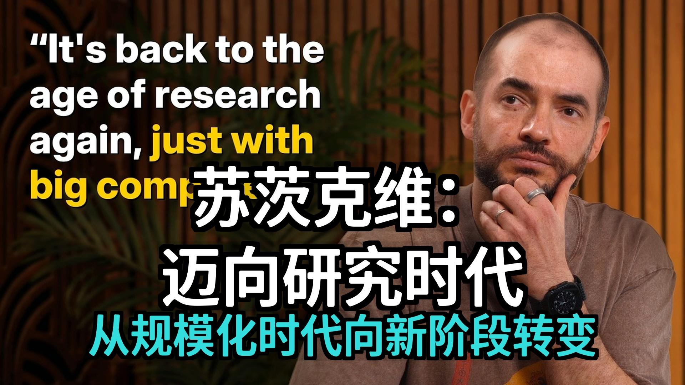

# Web3天空之城 - Bilibili 动态摘要

> 来源：https://t.bilibili.com/1139394917437538309  
> 发布时间：2025年11月26日 10:34  
> 生成时间：2026-02-23 09:57:25

---

## 摘要

这份Bilibili用户“Web3天空之城”的动态图片文字内容，深入探讨了人工智能（AI）的现状、挑战及未来愿景。

**核心观点与主要内容：**

演讲者指出，当前AI技术发展迅速（如“湾区的事情”），但其在评估中表现出色，经济影响和泛化能力却存在脱节。AI模型常出现重复性错误，显示出其在泛化方面的不足。对此，演讲者提出两种解释：强化学习（RL）训练可能导致模型过于专注和目光狭隘，或因训练数据过于迎合评估指标。他以“万小时训练的竞赛程序员”与“具备内在特质的优秀学生”类比，认为现有模型更像前者，缺乏人类的通用学习能力。

他强调，AI发展正从“规模扩展时代”（以GPT-3为代表）回归“研究时代”，未来需寻找新的“配方”，而非仅靠扩大规模。在RL中引入“价值函数”概念，将能显著提高学习效率和泛化能力，因为它允许模型在任务早期评估行动好坏。

**关键信息与独到见解：**

1.  **泛化能力是瓶颈：** AI模型在泛化能力上“惊人地差”于人类，表现为样本效率低下和难以习得人类期望的复杂技能。人类的学习更无监督、稳健且样本需求少，这可能源于进化赋予的先验知识和内置的“价值函数”（即情感）。理解并复现人类这种学习能力是AGI的关键。
2.  **超级智能的定义与部署：** 预测AGI将在5-20年内出现。超级智能可能不是一个“已完成的心智”，而更像一个“超级聪明的15岁少年”，具备极强的持续学习能力。其部署将加速经济增长，通过多个学习型AI实例在经济中执行不同工作并融合知识，最终形成功能上的超级智能。
3.  **安全与对齐：** 随着AI能力增强，前沿公司和政府将被迫在AI安全上合作。演讲者主张，理想的AI应“关怀有感知生命”，而非仅限于人类，因为未来AI将成为感知生命的主体。他甚至提出了“神经连接技术”作为实现人类与AI平衡融合的可能方案。
4.  **SSI的愿景与“研究品味”：** SSI作为一家纯研究公司，旨在通过独特的技s术方法解决泛化能力等根本性问题，引领超级智能的安全发展。他定义“研究品味”为对人脑的“正确”启发，追求构建AI时的美感、简洁、优雅，并拥有自上而下的信念来坚持正确的方向。

演讲者认为，AGI的强大难以想象，这正是需要展示和教育公众的原因。当前AI的错误感使其显得不强大，但当错误减少时，AI将“感觉强大起来”，并彻底改变世界。

---

## 原始内容

**图片提取文字**：

#### 图片 2

你知道什么很疯狂吗？
但这全都是真实的。

就像所有这些人工智能和湾区的事情
，它们正在发生。
这不像是直接从科幻小说里出来的
吗？
另一件疯狂的事情是，这种缓慢的起
飞感觉多么正常。
比如，我们要在人工智能上投入GDP
的1%，我觉得这本应是个更大的事件
，但现在感觉就像……
事实证明，我们很快就习惯了事物。

但它也有点像是抽象的。
比如，它意味着什么？
你在新闻中看到了它。
某某公司宣布了某某金额。
到目前为止，这并没有以任何其他方
式被感受到。
我们现在真的要开始感受到这种影响
了吗？

我认为关于“从普通人的角度来看，
没什么太大的不同”这一点，即使到
了奇点，仍然是成立的。
所以我说的“感觉没有变化”是指
，比如某某公司宣布了一笔难以理解
的巨额投资，我不认为有人知道该如
何处理这笔钱。
但我认为人工智能的影响将会被感受
到，它将渗透到整个经济体系中，这
背后存在着非常强大的经济驱动力。

你预计这种影响何时会到来？

我认为这些模型的表现比它们的经济
影响所暗示的要智能。
这是目前模型中非常令人困惑的一点
。
如何调和它们在评估中表现如此出色
的事实。
你看看这些评估，你就会觉得，那些评
估相当难。
它们的表现如此出色，但经济影响似
乎远远落后。
感觉很难理解模型一方面能做这些惊
人的事情，而另一方面，在某种情况
下会重复自己两次，一个例子是，比
如你使用
Vibe
编码做某事，然后你去某个地方，然
后遇到了一个错误。
然后你告诉模型，请修复这个错误好
吗？
模型说，我的天，你说得太对了，我
有一个错误，让我去修复它。
然后它又会引入第二个错误。
然后你告诉它，你有了这个新的，第
二个错误。
然后它告诉你，我的天哪，我怎么会
犯这样的错误？
你又说对了。
然后它又回到了第一个错误。
你可以在这两者之间交替。
然后你就想，这怎么可能呢？
我不确定。
但这确实暗示着，有些奇怪的事情正
在发生。

我有两种可能的解释。
更有点异想天开的解释是，也许强化
学习训练使得模型变得有点过于一根
筋和目光狭隘，有点过于缺乏觉察，
尽管它在其他方面也让它们有所觉察
。
正是由于这一点，他们无法完成基本
的事情。

但还有另一种解释，那就是在人们进
行预训练的时候，训练数据的问题之
所以得到解决，是因为答案就是“所
有数据”。
当你进行预训练时，你需要所有的数据
，所以你不需要去想，是使用这些
数据还是使用那些数据。
但是当人们进行强化学习训练时，他
们确实需要思考。
他们会说，好的，我们希望针对这个
任务进行这种强化学习训练，针对那
个任务进行那种强化学习训练。
据我所知，所有公司都有专门的团队
来制作新的强化学习环境，并将其添
加到训练组合中。
然后问题就来了，那么，这些环境是
什么呢？
有太多的自由度了。

你可以做的一件事，我认为这是无意
中发生的事情，就是人们从评估中汲
取灵感。
你说，嘿，我希望我们的模型在发布
时表现出色，我希望评估结果看起来
很棒。
有什么强化学习训练可以帮助完成这
项任务呢？
我认为事情确实会发生，而且我认为
这可以解释很多正在发生的事情。
如果你将此与模型泛化能力不足结合
起来，就有可能解释我们所看到的很
多现象，即评估性能与实际现实世界
性能之间的脱节，而我们今天甚至不
完全理解“现实世界性能”的确实含
义。

我喜欢这个观点，即真正的奖励作弊
是那些过于关注评估的人类研究人员
。

我认为有两种方式来理解或尝试思考
你刚刚指出的内容。
一种是看，如果仅仅是通过成为超人
般的编码竞赛选手，模型并不会自动
变得更有品味，并对如何改进你的代
码库做出更好的判断。
那么，你应该扩展环境套件，以便你
不仅仅是在编码竞赛中测试其最佳性
能。
它还应该能够为X事物、Y事物或Z事物
做出最适合的应用。

另外一个，也许你暗示的是，为什么
首先成为超人的编程竞赛选手并不能
让你成为一个更有品味的程序员，或
者更普遍地来说。
也许应该做的事情不是不断增加环境
的数量和环境的多样性，而是要找到
一种方法，让你能从一个环境中学习
，并提高你在其他事物上的表现。

所以我有一个可能有用的人类类比。
既然你提到了竞争性编程，我们就以
竞争性编程为例。
假设你有两个学生。
其中一个决定他们想成为最优秀的竞
争性程序员，所以他们将在这个领域
练习一万小时，解决所有问题，记住
所有证明技巧，并非常非常、非常熟
练地快速正确地实现所有算法，通过
这样做，他们成为了最优秀的学生之
一。
学生二认为，竞争性编程很酷，也许
他们练习了100小时，比前者少得多，
而且他们也做得非常好。
你认为哪一个在他们后来的职业生涯
中会做得更好？
第二个。

我认为这基本上就是正在发生的事情
。
这些模型更像是第一个学生，甚至更
进一步，因为我们接着说，那么模型
应该擅长竞争性编程，所以让我们获
取有史以来每一个竞争性编程问题，
然后我们再做一些数据增强。
这样我们就有更多的竞争性编程问
题，并且我们在此基础上进行训练。
这样一来，你就拥有了这个很棒的竞
争性程序员。

而且用这个类比会更直观，那就是，
如果它训练得如此充分，就像所有不
同的算法和所有不同的证明技术都触
手可及一样。
而且更直观的是，有了这种程度的准
备，它不一定能泛化到其他事物上。

那么，在进行那100
小时微调之前，第二个学生在做什么
的类比又是什么呢？
我认为就像他们拥有了它一样。
我认为是那种“特质因素”。
是的。就像我知道，比如当我还是本
科生的时候，我记得有一个学生像这
样和我一起学习。
所以我知道它的存在。

我认为将它与预训练所做的任何事情
区分开来很有趣。
所以理解你刚才说的关于我们不必在
预训练中选择数据的一种方式是说，
实际上，它与一万小时的练习没有太
大区别。
只是你免费获得了那上万小时的练习
，因为它已经存在于预训练分布中的
某个地方。
但这就像你可能在暗示，实际预训练
的泛化能力并没有那么多。
只是免费训练中有如此多的数据。
但这不像它在泛化方面一定比强化学
习更好。
预训练的主要优势在于
A. 即数据量非常大。B
是你不费心去思考应该把什么数据
放入预训练中，而且它是一种非常自
然的数据，它包含了人们所做的很多
事情，人们的想法以及很多特征，就
像整个世界被人投射到文本上一样
，而预训练试图利用海量数据来捕捉
这一点。

预训练非常难以推理，因为很难理解
模型依赖预训练数据的方式。
每当模型犯错时，是否可能是因为某
些东西碰巧在预训练数据中支持不足
？

预训练的支持可能是一个比较宽泛的
说法。
我不知道我是否能就此增加更多有用
的见解，但我认为人类中没有与预训
练相对应的类比。

这里有一些人们提出的关于人类类比
于预训练的类比，我想听听你对它
们可能出错的看法。
一种是将一个人生命中的前18年、15
年或13年视为一个阶段，那时他们不
一定具有经济生产力，但他们正在做
一些让他们更好地理解世界的事情，
等等。
另一种是将进化视为完成某种服务。
进行了30亿年，然后产生了一个人类
生命实例。
那么我很好奇你是否认为这些类比中
任何一个与预训练真正相似，或者如
果你不考虑预训练，你会如何看待至
少人类一生的学习是怎样的？

我认为这两者与预训练都有一些相似
之处，而且预训练试图扮演这两者的
角色。
但我认为存在一些巨大的差异。
预训练数据的量非常、非常惊人。
而且不知何故，一个人个体，即使
在15年后，只利用了部分预训练数
据的一小部分，他们所了解的也要少
得多。
但无论他们知道什么，他们知道得都
要深得多，不知怎的。
而且，比如在这个年龄，他们不会犯
像大型语言模型那样的错误。

还有一件事，你可能会问，这会不会
是某种类似进化的东西？
答案是也许，但在本例中，我认为进
化能确实具有优势。
比如，我记得读过一个案例，一些，
这是神经科学家做的一件事，或者更
确切地说，是神经科学家了解大脑的
一种方式，就是研究大脑不同部位受
损的人。
有些人表现出你可以想象到的最奇怪
的症状。
实际上非常、非常有趣。
我记得一个与此相关的案例。

我读到过一个人，他有某种脑损伤，
我想是一次中风或事故，导致他的情
绪处理功能丧失了。
所以他不再有任何情绪了。
结果是，他仍然非常健谈，能够解决
一些小难题，而且在考试中他似乎表
现得很好。
但他感受不到任何情绪，他不会感到
悲伤，不会感到愤怒，也不会感到兴
奋，他不知道怎么地在做任何决定时都
变得非常糟糕，他需要花上几个小时
来决定穿哪双袜子，而且他会做出非
常糟糕的财务决定，这非常说明了我
们内置的情绪在使我们成为一个可行
的主体方面究竟扮演着什么样的角色
。

我想，联系到你关于预训练的问题，
这就像是，也许如果你在预训练中足
够擅长获取所有信息，你也可以获得
那种能力。
但这件事情似乎，嗯，它可能从预训
练中获得，也可能无法获得。
那是没什么。显然不只是直接的情绪。

#### 图片 3

它看起来像是一种近似于价值函数的
东西，它告诉你应该做出什么样的决
定，比如任何决定的最终回报应该是
什么。

你不认为这会不经意地来源于，我认为
为有可能会。

我只是说它不是一个，不是百分之百
明确的。

但那又是什么呢？
比如，你如何看待情绪？
情绪在机器学习中有什么类比吗？
它应该是一种价值函数之类的东西。
是的。但我认为没有一个很好的机器
学习类比，因为目前价值函数在人们
所做的事情中并不扮演非常重要的角
色。

如果你想这么做，也许值得为听众定
义一下什么是价值函数。
当然，我非常乐意这样做。
那么当人们进行强化学习，目前进行
强化学习的方式是怎样的呢？
人们如何训练那些智能体？
所以你有一个神经网络，你给它一个
问题。
然后你告诉模型，去解决它。
模型可能会采取数千次、数十万次的
行动。
或者思考或别的东西，然后它产生一
个解决方案，该解决方案会被评分。
然后该分数被用来为它的轨迹中的每
一个动作提供一个训练信号。
这意味着如果你做的事情耗时很长，
如果你在训练一个需要很长时间才能
解决的任务，你将完全学不到任何东
西，直到你提出了拟议的解决方案。
强化学习就是这样做的。天真地做。

价值函数表达的意思，看，也许我
有时可以，不总是，告诉你你做得好
还是不好。

价值函数的概念在某些领域比在其他
领域更有用。

例如，当你玩国际象棋时丢了一个棋
子，我搞砸了，你不需要下完整个对
局就知道我刚才做的很糟糕，因此在
此之前所做的一切也都是糟糕的。
所以价值函数可以让你跳过直到最后
才计算权重。

比如我们假设你开始追求某种，好的
，我们假设你正在做某种数学或编程
方面的事情。
并且你正在尝试探索一个特定的解决
方案方向。
在经过，比如说，一千步思考后，你
得出结论，这个方向没有前途。
一旦你得出这个结论，你就可以在决
定沿着这条路走的一千步之前就获得
了奖励信号。
你会说，下次，在类似的情况下，我
不应该再走这条路了，这比你实际提
出一个拟议的解决方案要早得多。

这在深度强化学习论文中提到过，即
轨迹空间非常广阔，因此很难学习从
中间轨迹和价值到编码的映射，而且
假设你有了错误的观念，然后你会回
去，然后你会改变一些东西，这听起
来像是对深度学习缺乏信心，当然这
可能很难，但没有什么事是深度学
习做不到的。

所以我预测是，价值函数应该是有
用的，而且我完全期待它们在未来会
被使用，如果不是现在的话。

我刚才提到的那个情感中受损的人
的情况，更多的是想表明，人类的价
值函数可能以某种重要的、由进化固
化的方式受到情绪的调节。
也许这对于人们在世界上有效运作是很
重要的。

正是我本来计划要问你的事情。
情绪的价值功能中有一个非常有趣的
点，那就是，尽管它们相当简单易懂
，却能产生如此大的效用，这一点令
人印象深刻。

所以我 Ra 两个回应。
我确实同意，与同样的事情相比。
我们所学的和我们所谈论的这类事情，
我们所谈论的情绪是相对简单的。
它们可能简单到也许可以用人类可以
理解的方式将它们描绘出来。

我认为那样做很酷。
尽管从效用的角度来看，我认为存在
一个权衡，存在这种复杂性、鲁棒性
之间的权衡。
复杂的事物可以非常有用，但在非常
广泛的情况下，简单的事物非常有用
。
所以我认为理解我们看到的一种方
式是，我们拥有的这些情绪，它们基
本上主要源于我们的哺乳动物祖先，
然后在我们成为人科动物时进行了
点微调。
尽管如此，我们确实拥有相当数量的
社会情绪，这是哺乳动物可能缺乏
的。

但它们不是很复杂，而且因为它们不
复杂，所以在与我们实际生活的在这
个非常不同的世界中，它们的服务效
果不佳，它们也会犯错误。
例如，我们的情绪，嗯，我不知道饥
饿算不算情绪，这一点有争议，但我
认为例如我们直觉上的饥饿感在这个
食物充裕的世界里并不能正确地指导
我们。

人们一直在谈论扩展数据、扩展参数
、扩展算力。
是否有更通用的思考扩展的方式？
其他的扩展维度是什么？

所以，这是一个观点。
这里有一个我认为可能是正确的观点
。
机器学习过去的工作方式是人们只是
用各种东西来思考，并试图获得有趣
的结果。
这就是过去发生的事情。
然后，规模化洞察出现了，规模化定
律、GPT3，突然之间，所有人都意识
到我们应该进行规模化。
这就是，这就是语言影响思维的一个
例子。
规模化只是一个词，但它是一个如此
强大的词，因为它告诉人们该怎么做
，他们说好的，让我们尝试扩大规模
，所以你说好的，那我们在规模化什
么呢？
预训练是用来规模化的一个东西，它
是一种特定的规模化方法。
预训练的重大突破是认识到这种方法
是有效的，所以你说喂，如果你将一
些计算力与一些数据混合到一个特定
大小的神经网络中，你就会得到结果
，而且如果你只是扩大这种方法的规
模，结果会更好。

这也很棒，大公司喜欢这一点，因为
它提供了一种风险非常低的资源投入
方式。
投入资源进行研究要困难得多。
比较一下。
如果你进行研究，你需要让研究人员
去研究并想出一些东西，而获取更多
数据、获取更多计算力，你知道你会
从预训练中得到一些成果。
事实上，根据各种情况来看，一些人
在推特上说，可能看起来像
Gemini
找到了一种从预训练中获得更多成果
的方法。
然而，在某个时间点，预训练的数据
将会用尽。
数据非常明确是有限的。

那么接下来怎么办呢？
要么你进行某种升级版的预训练，采
用与之前不同的配方，要么你在做强
化学习，或者可能还有其他方法。
但在算力很大，计算机现在非常庞
大。
从某种意义上说，我们回到了研究的
时代。
所以也许换一种方式来表达。
从2012年到2020年，这是研究的时代
。
现在，从2020年到2025年，是规模扩
展的时代。
或者可能是多少。
让我们为那些年份加上误差线，因为
人们说这很惊人，你必须扩大规模，
继续扩大规模，那个词就是“扩大规
模”，但现在规模已经非常大了，比
如，人们真的相信，它这么大，但如
果你有大100倍的一切，也都会截然
不同，肯定会有不同，但相信只要把
规模扩大100倍，一切都会改变吗？
我不认为那是真的，所以又回到了研
究时代，只是有了大型计算机。

这是一个非常有趣的说法。
但让我问你刚才提出的问题。
我们在扩展什么，拥有一个“配方”
意味着什么？
因为我猜我没有意识到一个非常清晰
的关系，它几乎看起来像一个物理定
律，这种关系在预训练中存在，即数
据或计算参数与损失之间存在幂律关
系。
我们应该寻求什么样的关系，我们应
该如何思考这个新“配方”可能是什
么样子。

所以我们已经目睹了从一种类型的扩
展到另一种类型的扩展的转变，从预
训练到强化学习。
现在人们正在扩展强化学习。
现在根据人们在推特上所说的，他们
在这个阶段在强化学习上花费的计算
量比在预训练上花费的还要多，因为
强化学习实际上会消耗相当多的计算
量。
你要进行非常非常长的回放。
所以要产生那些回放需要大量的计算

然后你会得到相对较少的学习拉动部
署。
所以你真的可以花费大量的计算资源
。

我可以想象，我不会在这个，在这个
，这更像是，我甚至不会称之为一种
规模。
扩展。
我会说，嘿，你到底在做什么？
你所做的事情是你目前能做的最有效
率的事情吗？
是的。你是否能找到一种更有效率的
方式来利用你的计算资源做这件事？
早些时候的价值函数业务，也许一旦
人们擅长价值函数，他们就会更有效
地利用他们的资源。
如果你找到一种全新的模型训练方式
，你可以问，这是扩展，还是仅仅是
你对资源的利用？

我认为这变得有点模糊不清。
在某种意义上，当人们处于研究时代
时，那时人们说的，嘿，我们来

试试这个、那个、再试试那个、再那
个。
噢，看，有些有趣的事情正在发生。
我认为将会有一种回归。

所以，如果我们回到了研究时代，退
一步讲，我们需要最关注食谱中的哪
个部分？
当你说价值函数时，人们已经在尝试
当前的食谱，但随后大型语言模型
作为裁判等等。
你可以说那是一个价值函数，但这听
起来你心里有更根本的东西。
我们是否需要回到甚至完全重新思考
预训练，而不仅仅是在该过程的末尾
增加更多步骤？

是的。所以关于价值函数的讨论，我
认为很有趣。
我想强调的是，我认为价值函数之类
的东西将使强化学习更加高效。
我认为这会产生影响。
但我认为，任何你可以用价值函数做
的事情，你也可以在没有它的情况下
做，只是速度更慢。

我认为最根本的一点是，这些模型在
泛化能力上几乎比人类差得惊人，这
非常明显，这似乎是一个非常根本性
的问题。

好的，所以这就是泛化的关键所在，
这里有两个子问题：一个关于样本效
率，即为什么这些模型需要比人类多
这么多数据才能学习？
第二个问题是，即使抛开所需数据量
不谈，为什么模型我们想要的东西
教给人类要困难得多？
也就是说，对于人类，我们不一定需
要一个可验证的奖励才能做到，你现
在可能正在指导许多研究人员，你和
他们交谈，向他们展示你的代码，向
他们展示你的思维方式。
从这些中学到他们的思维方式以及他
们应该如何进行研究。
你不必为他们设置一个可验证的奖励
。

#### 图片 4

这是你课程的下一部分。
而且，这次训练不稳定，而且没有这
种琐碎的定制化过程。
所以也许这两个问题实际上以某种方
式相关联。
但我对探索第二点很感兴趣，这更像
是持续学习，而第一点感觉就像是样
本效率。

所以你可以真正思考一下，关于人类
样本效率需要考虑的一个可能解释是
进化。
而进化给了我们尽可能少量的最有效
信息。
对于视觉、听觉和运动等事物，我认
为进化实际上给了我们很多，这一点
有很强的证据支持。
举个例子，人类的灵巧度远远超过，
如果对机器人进行大量的模拟训练，
它们也可以变得灵巧。
但是，让机器人在现实世界中像人一
样快速学习一项新技能，似乎还遥不
可及。
在这里你可以说，比如运动能力，我
们所有的祖先都需要出色的运动能力
, 松鼠，比如，所以运动能力可能意
味着我们拥有一些难以置信的先验知
识。

视觉方面也可以做同样的论证，我相
信颜拉·汗曾指出，比如儿童在练习10
小时后16小时内学会开车，这很真实
，但我的视觉非常好，至少对我而言
，当我回忆起自己五岁的时候，我那
时对汽车非常着迷，我确信我五岁时
对汽车的识别能力已经足够用于自动
驾驶了，五岁时你看不到太多数据，
你大部分时间都在父母家里度过，所
以你的数据多样性非常低。
但你可能会说，也许这也是进化。
但语言和数学编码，可能不是。
它们仍然似乎优于模型。
模型在语言和数学编码方面显然优于
普通人类，但在学习方面它们是否也
优于普通人类呢？
绝对是。

我想说的是，语言、数学编码，尤其
是数学编码表明，使人们擅长学习的
任何东西可能不是一个复杂的先验知
识，而更像是一些基本的东西。
等等，我不确定我是否理解了。
为什么会是这样呢？
所以考虑一项人们表现出某种高度可
靠性的技能，或者，如果这项技能对
我们的祖先在数百万年、数亿年里非
常有用的话。

也许人类擅长某些能力是因为进化，
因为我们存在某种微妙的进化先验
知识，使得我们在这方面表现出色。
然而，如果人们在一个直到最近才出
现的领域表现出很高的能力、可靠性
、鲁棒性和学习能力，这更说明人类
可能只是拥有更强的机器学习能力。

那么我们应该如何思考这种能力究竟
是什么？它与机器学习的类比是什么
？关于人类的学习能力，有几件有趣
的事情：它需要的样本更少，它更无
监督。例如，一个青少年学习驾驶汽
车，并不是因为预先存在一个可验证
的奖励机制，而是源于他们与机器
和环境的互动，但他们需要的样本却
少得多。人类的学习看起来更无监督
、也更稳健，这种稳健性非常惊人。
我们是否有一种统一的方式来思考所
有这些特性为何同时发生？什么样的
机器学习类比可以实现这一切？

关于青少年驾驶员如何在没有外部指
导的情况下自我修正并从经验中学习
，答案是他们拥有自己的价值函数和
普遍的感知。人类的价值函数极其稳
健，除了少数与成瘾相关的例外。一
个正在学开车的青少年，一开始开车
就会对自己的状况产生一种感觉，知
道自己有多不自信。然后他们会观察
反馈，学习速度非常快，可能十小时
后就能上路了。这表明人类确实有某
种解决方案，但我们好奇他们是如何
做到的，以及我们如何需要重新概念
化训练模型的方式才能实现这一点。

这是一个我有很多看法的领域，但我
认为人类能够达到这种状态，证明了
某种机器学习原理是存在的。也许还
存在另一个阻碍因素，那就是人类神
经元实际上的计算量可能比我们想象
的要大。如果属实，事情可能会更困
难。但我确实认为这指向了某种机器
学习原理的存在，尽管环境使我难以
详细讨论。

我必须从第一性原理出发思考通用人
工智能 (AGI) 的瓶颈是什么，因为这
似乎是研究的重点。这个问题的一部
分涉及及到思考强化学习 (RL) 的扩展
性，即我们如何能让它更好地泛化。
我阅读了一篇关于 RL
扩展性的论文，显示其学习覆盖率看
起来像一个 S
形曲线：模型长时间内缓慢，然
后迅速加速，最后趋于平稳。这与预
训练中初期学习迅速、后期减慢的幂
律非常不同。

这让我想起一位研究人员朋友的观点
：找到一个正确答案所需的样本数量
，会随着当前概率分布与目标概率分
布的差异程度呈指数级增长。我模糊
地感觉到这两个想法应该有关联，但
我无法形式化。

我将我的困惑和那张照片输入给
Gemini
3，要求它找出联系。它意识到在强化
学习中，从“是”或“否”的结果中
获取信息的正确建模方式是随机二元
变量的熵。它绘制了强化学习与监督
学习中，随着通过率增加，每次采样
的增益比特数如何变化的图表。看到
这张图表后，很多事情对我来说都变
得有意义了。

然后我想验证这个理论是否有经验基
础，于是让
Gemini
编写代码进行实验，以证明损失的改
善是否会随通过率按这种方式扩展。
我运行了
Gemini
输出的代码，结果相似，但与预期不
完全一致。我将图表输入给
Gemini，它提出了一个合理的假设:

我们通过固定的学习率限制了监督学
习在初始阶段的提升上限，事实上，
学习率应该随着时间推移而降低。这
直观地解释了为什么实践中存在学习
率调度器。我完成了从提出模糊问题
、建立理论理解到运行实验的整个流程
，都是用
Gemini 3
完成的。它是我们遇到的第一个能建立
我预料之外的新的联系的模型，现在已
成为我集思广益新思路时的默认选择
。

你提到我们回到了一个研究时代，经
历了
2012 年到 2020
年的规模化时代。那么，如果回到那
个研究时代，现在的氛围会是怎样的
？即使在
AlexNet
之后，前沿系统的规模仍然在扩大，你
现在是否认为这个研究时代仍然需要
大量的计算资源？你是否认为需要回
到档案库中阅读旧论文？在谷歌、Op
enAI

和斯坦福等地，当时的研究氛围是
怎样的？社区中我们应该期待出现什
么样的现象？

规模化时代的一个后果是，规模化吸
走了房间里所有的空气，导致每个人
都开始做同样的事情。我们达到了这
样一个地步：公司的数量远超想法的
数量。硅谷有句老话：想法是廉价的
，执行才是最重要的。但也有人反驳
说，如果想法如此廉价，为什么没有
人有新想法？

如果你从瓶颈的角度考虑研究进展，
会存在几个瓶颈。回溯到上世纪
90
年代，当时有一些不错的想法，但缺
乏更大的计算机，他们只能做一
个很小的演示，无法说服他人。因此
，瓶颈在于计算能力。在规模扩展的
时代，计算机大幅增加，计算能力巨
大，以至于用更多计算量来证明某个
想法是否必要这一点并不明显。

例如，AlexNet 是在两块 GPU
上构建的。Transformer 在 2017
年没有单个论文实验使用的 GPU
超过 64
块。相比之下，今天的计算量是巨大
的。对于研究来说，肯定需要一定量
的计算资源，但远非绝对必要使用有
史以来最大的计算量。如果你想构建
绝对最好的系统，更多的计算资源会
有帮助，尤其是在所有人都遵循相同
范式时，计算资源成为主要区别因素
之一。

但我好奇的是，你当时真的在场，听
起来使用最少量的计算资源就有可能
发展出这些想法。但事实并非如此，T
ransformer
模型之所以成名，是因为它在越来越
高的计算量级别上得到了验证，并被
大家采用和构建。如果在
SSI 有 50
个不同的想法，在没有其他前沿实验
案那样计算资源的情况下，你如何知
道哪个是下一个

Transformer，哪个是脆弱的？

我对对此发表评论。具体来说，SSI
用于研究的计算量实际上不算少。我
来解释一下，我们筹集了
30
亿美元，这本身不算少，但从绝对意
义上讲已经很多了。你可能会说，
其他公司筹集了更多资金。然而，他
们大部分计算资源都用于推理。这些
大笔资金主要也是为了推理。其次，如
果你想要一个可以进行推理的产品，
你需要庞大的工程师和销售队伍，以
及大量研究投入到与产品相关的功能
中。所以当你审视真正剩下的研究内
容时，差距就小得多了。

另一件事是，如果你在做一些不同的
事情，你真的需要绝对最大的规模才
能证明它吗？我认为这并非事实。我
认为在我们这个案例中，我们拥有足
够的算力来证明我们所做的是正确的
。
有公开估算显示，像
OpenAI

这样的公司每年在实验上花费大约五
六十亿美元，这与他们在推理等方面
花费的是分开的。所以他们每年花在
运行研究实验上的钱，可能比你们公
司的总资金还要多。

我以为这是关于你如何使用计算资源
的问题。我认为在其他公司，对训练
计算的需求要大得多，有更多不同的
工作流，不同的模态，事情更碎片化
。

SSI
将如何盈利？我的回答是，我们现在
专注于研究，那个问题的答案自然会
呈现出来。我认为会有很多可能的答
案。

SSI
的计划仍然是直接实现超级智能吗？
我认为这有其价值，因为不受日常市
场竞争的影响是非常好的。但我认为
有两个原因可能会导致我们改变计划
：

一是如果时间线变得很长，二是强
大的、有影响力的
AI 对世界具有巨大的价值。

你默认的计划是直接追求超级智能的
原因是？OpenAI、Anthropic
等公司的明确想法是，让公众逐渐适
应越来越强的智能。为什么直接构建
一个超级智能可能更好呢？

我将陈述支持和反对的理由。支持的
理由是，参与市场竞争的“老鼠赛跑
”非常艰难，会带来艰难的权衡。能
够绝缘干扰，只专注于研究，等到准
备好才出现，这很不错。

但反驳的观点也同样有效，而且这些
是相互对立的力量。反驳的观点是，
让世界看到强大的人工智能是有益的
，因为那是你能够传达人工智能本身
的方式，而不是仅仅传达关于人工智
能的想法。

#### 图片 5

你说的“传达人工智能”是什么意思
?假设你读了一篇关于人工智能的文
章，你觉得那是一篇有趣的文章。现
在假设你看到人工智能正在做某件事
，这是无法相比的。我认为人工智能
存在于公众视野中会带来巨大的好处
。

我想这不仅是其中一个重要部分。另
一个重要因素是，在人类工程学和其
他人文科学中，最终产物的安全性提
高主要来自思考如何使其安全，而不
是事后补救。例如，如今每英里的飞
机失事率远低于几十年前，Linux
中的错误也更难发现。我认为这主要
是因为这些系统已经部署到全世界，
故障被注意到并修正了，系统变得更
加健壮。

我不确定人工智能和超级智能会有什
么不同，特别是考虑到，超级智能的
危害不仅仅是一个严重的“回形针最
大化器”，而是一个我们甚至不知道
如何概念化人们将如何与之互动的强
大事物。逐步获取它似乎是分散其影
响、帮助人们做好准备的更好方式。

我认为即使在直接部署的情况下，你
仍然会采取渐进式发布，或者说，渐
进主义将是任何计划中固有的组成部
分。这只是一个关于你首先推出什么
的问题。

另外，我坚信持续学习是重要的，并
且是正确的方向。我再举一个关于思
维如何受语言影响的例子，有两个词
塑造了每个人的思维，我坚持认为是
“通用人工智能”(AGI)和“预训练
”。

“通用人工智能”(AGI)这个术语存
在的原因，与其说是它描述了一种重
要的智能终极状态，不如说是对“狭
隘人工智能”(Narrow
AI)的反应。回顾早期的游戏
AI，人们指出它们非常狭隘，比如国
际象棋
AI
只能下象棋。作为回应，一些人认为这
不好，太狭隘了，我们需要的是可以
做所有事情的
AGI。

第二个受到关注的术语是“预训练”
，特别是预训练的配方。目前人们做
强化学习(RL)的方式可能正在消除
预训练的概念影响，但预训练具有这
样的特性：你做更多的预训练，模型
在几乎所有方面都会变得更好，大致
均匀提升。AGI
但是
AGI
和预训练发生的事情是，在某种意义
上，它们超出了目标。因为如果你思
考
AGI
这个术语，你会意识到，特别是预
训练的背景下，人类并不是
AGI。人类肯定有一个技能基础，但人
类缺乏大量的知识，相反，我们依赖
持续学习。

那么，假设我们成功地创造了一种安
全的超级智能，问题是如何定义它?
在持续学习的曲线上，它会在哪里
?
我可能会产生一个像一个非常渴望学
习的、超级聪明的
15
岁的少年，他们对很多事情知之甚少，
但非常热切。然后你让他们去程序
员或医生，让他们去学习。所以你可
以想象，部署本身将涉及某种学习的
试错阶段，它是一个过程，而不是你
扔出一个完成品。

我明白了。你的意思是，你指出的关
于超级智能的东西，并不是一个知道
如何在经济中完成每一项工作的、已
完成的心智。你提出的模型是可以学
会做任何单一工作的，每一个工作，
这就是超级智能。一旦有了学习算法
，它就会以人类劳动力可能加入组织
的方式部署到世界。

似乎会发生这两件事之一，也许两者
都不会发生。第一个，这个超高效的学
习算法变得超人，变得和你一样好，
甚至在机器学习研究这项任务上变得
更好，结果是算法本身变得越来越超
人。第二种情况是，即使那样没有发
生，如果你有一个单一的模型——这
明确是你的设想——其部署在经济中
，执行不同工作的实例，学习如何完
成这些工作，在工作中持续学习，学
习到任何人类可以学到的所有技能，
但实际上同时学习所有这些技能，然
后将这些学习到的东西融合起来，那
么你基本上就拥有了一个在功能上变
得超级智能的模型，即使没有任何软
件层面的递归自我改进。因为你现在
有一个模型可以完成经济中的每一项
工作，而人类无法以同样的方式融合
心智。

那么你是否预期在广泛部署后会出现
某种智能爆炸？我认为很可能会出现
快速的经济增长。广泛部署后，如果
你确实达到了拥有一个可以快速学习
做事的的人工智能的点，并且有很多这
样的
AI,那么除非有监管阻止，否则将有
强大的动力将它们部署到经济中。在
一段时间内出现非常快速的经济增长
是很有可能的。

至于速度有多快，这很难判断。一方
面你有非常高效的工人，另一方面世
界非常庞大，很多事情以不同的速度
移动。但另一方面，AI现在可以加速
。所以，非常快速的经济增长是可能
的。我们将看到各种情况，比如不同
国家有不同的规则，规则更友好的国
家，经济增长会更快。很难预测。

在极限情况下，我们知道这应该是可
能的：如果你拥有一个在学习方面和
人类一样好的东西，但它可以以人类
无法合并的方式合并其“大脑”，
合并不同的实例。这似乎在物理上应
该是可能实现的。人类是可能的，数
字计算机是可能的。你只需要将这两
者结合起来就能产生这个东西。而且
这两种东西似乎也非常……

强大，经济增长是其中一种说法，但
另一种说法是，对于一个在职的人类
而言，可能存在一个非常短的时间段
，因为一旦雇佣，人类在六个月内基
本上就实现了净生产力。人类学习速
度极快，技术正变得越来越智能。我
们如何思考如何让这种发展顺利进行
，以及为什么
SSI能够很好地做到这一点，或者
SSI
的计划是什么，本质上就是想了解这
些。

我的想法发生变化的一种方式是，我
现在更重视人工智能的增量式和预先
部署。人工智能一个非常困难的地方
在于，我们正在谈论的是尚不存在的
系统，并且很难想象它们。我认为正
在发生的一件事是，在实践中，非常
难以感受到通用人工智能(AGI)的真
实存在。我们可以谈论它，但这就像
谈论遥远的未来，就像想象年老体衰
时的感受，你可以进行对话，可以尝
试想象，但这只是很困难，然后你回
到现实，情况并非如此。

我认为围绕
AGI
及其未来能力的许多问题，都源于这
样一个事实：非常难以想象未来的
AI
将会是强大的，并且会与现在不同。
事实上，整个
AI和
AGI
的问题，核心在于能力。整个问题在
于能力。当能力非常强大时，会发生
什么？

过去一年中我改变想法的方式之一，
反映到我们公司的计划中，那就是，
如果很难想象该怎么做，你必须展示
出来，你必须展示出来。我坚持认为，
我认为大多数从事人工智能的人也无法
想象，因为它与人们日常所见的事物
差异太大了。我确实坚持认为，我在这
里预测一件事将会发生，这是一个我
坚持的预测，那就是随着人工智能变得
越来越强大，人们的行为将会改变。
我们将看到所有现在没有发生的、前
所未有的事情。

我确实认为，无论好坏，前沿公司将
在未来的发展中扮演非常重要的角色
，政府也是如此。而且我我认为你将看
到一些事情的开端，即那些激烈竞争
的公司开始在人工智能安全方面进行
合作。你可能已经看到了
OpenAI和
Anthropic
迈出了第一个小小的步伐，但这种合
作以前是不存在的。这正是我大约三
年前在一次演讲中预测会发生的事情
。我还是坚持认为，随着人工智能变
得越来越强，越来越明显地强大，政
府和公众也会产生做什么的愿望。我
认为这是向人工智能展示其重要性
的一般非常重要的驱动力，这是第一
点。

第二点，那么人工智能正在被构建，
需要做什么呢？我坚持认为会发生的
一件事是，目前从事人工智能工作的
人们，我坚持认为人工智能感觉不到
强大是因为它的错误。我确实认为，
在某些时候，人工智能会开始感觉强
大起来。我认为当这种情况发生时，
我们将看到所有人工智能公司对待安
全的方式发生巨大变化。它们会变得
更加偏执。我这样说是基于一个我预
测将会发生的事件。我们将看看我是
否正确。但我认为这是会发生的事情
，因为他们将看到人工智能变得越来
越强大。我认为目前发生的一切都是
因为人们看待当今的人工智能时，很
难想象未来的
AI。

而且还有第三件事必须发生，我认为
就是这个，我从更广泛的角度谈论它
，而不仅仅是从
SSI
的角度谈论，因为你问我关于我们公
司的看法，但问题是，那么公司应该
以什么为目标去构建什么呢？有一个
大家一直深陷其中的重大理念，那就
是自我改进的
AI。为什么会发生这种情况？因为公
司的数量多于想法的数量。但我坚持
认为有更好的东西可以构建。我认为
每个人都会真正想要那个东西，就像
一个牢固地、明确地致力于关怀有感
知生命的
AI。

我认为特别是，有一种论点可以提出
，构建一个关怀有感知生命的
AI比仅构建一个只关怀人类生命的
AI
要容易，因为
AI
本身也会是有感知的。如果你考虑像
神经元和人类对动物的同理心，你
可能会争辩说它不够强大，但它的确
存在。我再认为这是我们通过用于模拟
自身的同一电路来模拟他人的这样一
个事实产生涌现属性，因为那是
最有效的做法。因此，即使你让一个
人工智能去了解有感知能力生命，
而且如果解决了对齐问题，我也不清
楚这是否是你应该努力做的事情，但
绝大多数有感知能力的生命体仍然会
是人工智能。最终将会有数万亿，乃

至于数万亿的人工智能。人类将只占
有感知生命体的极小一部分。所以，
如果目标是某种人类对这个未来文明
的控制，那么这是否是最佳标准，对
我来说并不明确。

这是事实。我认为这可能是。这不是
最佳标准。我想说两点。我认为第一
点，我认为如果存在，所以我认为
关心有感知能力的生命，我认为它有
其价值。我认为应该予以考虑。我认
为如果有一个简短的、想法清单，然
后
公司在遇到这种情况时可以利用，那
将会是有帮助的。这是第二点。第三
点，我认为如果最强大的超级智能的
能力在某种程度上受到限制，将会带
来实质性的帮助，因为这将解决许多
此类担忧。如何做到的问题，我不确
定，但我想在谈论真正非常强大的系
统时，这将提供实质性的帮助。

在我们继续讨论要素之前，我想就这
一点做进一步的深入探讨。顶层还有

#### 图片 6

多大的空间？您如何看待超级智能？
您认为，我是说，利用这种学习效率
的想法，它可能只是极快地学习新技
能或新知识吗？并且它是否拥有更庞
大的策略库？核心中心是否存在一个
单一的、统一的、更强大的或更大的
“它”？如果是这样，您是否想象它
与其余人类文明相比将是神一般的存
在，还是仅仅感觉像是另一个智能体
或另一组智能体？

所以这是不同的人有不同直觉的一个
领域。我认为这肯定会非常强大。我
认为最可能发生的情况是，将会有
多个这样的人工智能大致在同一时间
被创建出来。我认为，如果集群足够
大，比如集群的大小达到洲际规
模，那么那个东西确实会非常强大。
如果你真的拥有一个洲际规模的集群
，那些人工智能可能会非常强大。我
能告诉你的就是，如果你谈论的是极
其强大的、真正具有戏剧性强大的人
工智能，那么如果它们能在某种程度
上受到约束，或者存在某种协议或类
似的东西，那会更好。

因为我认为，如果你在说，嘿，比如
如果你真的，比如超级智能的担忧是
什么？解释这种担忧的一种方式是什
么？如果你想象的功能足够强大的
系统，比如真正功能强大，你可以说
，你需要做一些合乎情理的事情，比
如以一种非常专一的方式关怀有生命
物，我们姑且这么说。我们可能不喜
欢这些结果。这就是它的真实面貌。
所以也许，顺便说一句，答案是你
不构建单一的、你不会以通常意义构
建一个相关性代理 (REL
agent)。事实上，我会指出几点。我
认为人类是一个半相关性代理 (semi-
arel
agent)。我们追求一个奖励，然后情
绪或其他因素使我们对这个奖励感到
厌倦。我们追求另一个奖励。市场就
像一种、就像一种非常短视的代理。
进化也是如此。进化在某些方面非常
智能，但在其他方面非常愚蠢。政府
的设计宗旨是三个部门之间进行永
无休止的斗争，这产生了影响。所以
我想思考诸如此类的事情。

使这次讨论变得困难的另一个原因是
，我们讨论的是尚不存在、我们不知
道如何构建的系统。那是另一回事。
这实际上是我的信念。我认为我们现
在所做的会取得一定进展，然后就
会逐渐消退。它会继续改进，但它也
不会是最终形态。所以那个最终形态
，我们不知道如何构建。我认为很多
事情取决于对可靠泛化的理解。

现在再说另一件事，就是，你可以说
的一件事是，什么会让这种对齐变得
困难，那就是人类的价值，你学习人
类价值的能力是脆弱的，那么你优化
这些价值的能力是脆弱的。你会，
你实际上学会了优化它们。那么你难
道不能说，这些都不是不可泛化的
实例吗？为什么人类似乎泛化得更好
呢？在这种情况下会发生什么？效果
会是什么。但那些我们做不到的，比
如那些问题现在仍然无法回答。

如何思考人工智能发展顺利的样子？
因为我认为你已经概述了人工智能可
能如何发展，将会有这类持续学习
的智能体。人工智能将非常强大。也
许会有许多不同的
AI。你认为许多大陆规模的智能体四
处游荡，情况如何？那有多危险？我
们如何才能减少这种危险？我们如何
以一种保护性地维持平衡的方式来做
这件事，即使存在着目标未对齐的
AI和不良行为者？

所以我喜欢关心有感知生命的AI
的一个原因，我们可以争论它是好是
坏。但如果最初的
N
这个宏大系统确实关心这一点——
关心、热爱人类或者其他什么，关
心有感知性的生命——显然，这也是
需要实现的。这也要实现。所以，
如果最初的那些系统能够实现这一点
，那么我认为至少在相当长的一段时
间内，事情会进展顺利。

然后是关于长期会发生什么的问题。
长期会发生什么？你如何实现长期均
衡？我也也有一个答案，我不喜欢
这个答案，但需要认真考虑。从长远
来看，你可能会说，如果你处于一个
短期内权力强大存在的世界，你可以
说，你实现了普遍的高收入，你实现
了普遍的高收入，我们都过得很好，
但我们知道佛教徒怎么说？变化是永
恒的，所以事物会变化，存在某种政
府政治结构的东西，它会发生变化，
因为这些东西都有保质期，出现了一
种新的政府事务，它在运作，但一段
时间后它就不再运作了，这是我们一
直看到的情况。

所以我想，对于长期均衡，一种方法
是你可能会说，也许每个人都会有一
个为他们办事的人工智能。那很好。
如果这种情况可以无限期地维持下去
，那确实如此。但是那样的缺点是，
那么人工智能就会去赚钱，为这个人
赚钱，并且，在政治领域为他们的需
求进行倡导。也许然后写一份小报告
说，这是我所做的，这是情况。然后
这个人说，太棒了，继续努力。但这
个人不再是一个参与者了。然后你可
以说那是一个危险的境地。但是，我
我声明一下，我不喜欢这个解决方案
，但它确实是一个解决方案。

这个解决方案是人们通过某种升级版
神经连接技术，与人工智能部分融合
。因为结果是，现在人工智能理解了
某些东西，我们也理解了它。因为
现在这种理解是整体性传输的。所以
现在，如果人工智能处于某种情境中
，你就仿佛完全身临其境。我认为这
就是实现平衡的答案。

我想知道，那些发展数百万年，甚至在
许多情况数十亿年前，在一个完全
不同的环境中发展起来的情绪，至今
仍然如此强烈地指导着我们的行为，
这是否是一个“对齐成功”的例子？
我来解释一下我的意思。脑干中存在
着这些，我不知道称之为价值函数还
是奖励函数更准确，但脑干有一个指
令，它告诉我们去与一个更成功的人
配交配。皮层是理解在现代环境中成功
意味着什么那个部分。但脑干能够
让皮层保持一致，并说，无论你如何
定义成功，我都不够聪明去理解那到
底是什么。你仍然会去执行这个指令

我认为有一个更普遍的观点。我认为
大脑如何编码高层次的欲望，实际上
是一个非常神秘的问题。抱歉，是进
化如何编码高层次的欲望。比如，进
化如何赋予我们对闻起来好的食物的
欲望，是相当容易理解的。因为气味
是一种化学物质，所以只需要追那
种化学物质。很容易想象进化会做这
样的事情，但进化也赋予了我们所有
这些社会欲望，比如我们非常在意被
社会积极地看待，我们不乎良好的声
誉，我们喜欢我们拥有的所有这些社
会直觉。我坚信它们是很深蒂固的，
但我不知道进化是如何做到的，因为
它是在大脑中表示的一个高层次概念
，比如人的想法，比如你说你关心某
个社会性的东西，它不像气味那样低
层次信号，它不是有传感器的东西
，大脑需要进行大量的处理，将许多
信息片段拼凑起来，以理解社会上发
生的事情，而进化如何说你应该关
心它是如何做到的？而且它做得很
快，因为我认为我们所关心的所有这
些复杂的社会性事物，我认为它们进
化得相当晚近。所以我认为在硬编码
这个高层次的欲望时是轻松的。我坚
持认为，或者至少我要说，我不知道
关于它是如何完成的有力假说。我拥
有一些正在思考的想法，但没有一个让
我满意。

尤其令人印象深刻的是，如果这是一
个你在有生之年学习的愿望，那还说
得通，因为你的大脑是智能的。为什
么我们能够学习智能的愿望是说得通
的。但你的观点是，这个愿望，也许
这不是你的观点，但理解它的一个方
式是，这个愿望是内建于基因组中的
。而基因组不是智能的，但它能够，
你不知如何能够描述这个，这个
特征甚至难以明确定义，并且你可以
将其植入，你可以将其构建到基因中
，本质上是这样。或者也许我换个方
式来说。如果你考虑基因组可用的工
具，它说，好的，这是一个构建大脑
的配方。你可以说，这里有将多
巴胺神经元连接到嗅觉传感器的“食
谱”。如果这种气味是某种，好闻的
气味，你就想吃它。我可以想象基因
组会这样做。我认为这更难想象。更
难想象的是，基因组会说你应该关
心一些你的整个大脑，就像你大脑的
一大块区域所进行的一些复杂的计算。

我只是声称这一点。我可以告诉你一
个推测，我一直在思考它如何才能实
现。让我提供一个推测，然后我将解
释为什么这个推测是错误的。所
以这个推测是，好的，大脑，大脑有
那些区域，皮层是。它有
所有那些大脑区域。皮层是均匀的，
但是大脑区域和皮层中的神经元，它
们大多数只是和它们的邻居交流。这就
解释了为什么你得到不同的脑区。
因为如果你进行某种言语处理，所
有负责言语的神经元都需要彼此交谈
。而且因为神经元在大多数情况下只
能与它附近的邻居交流，所以它必
须是一个区域。从人到人，所有这些
区域大多位于相同的位置。所以也许
进化在字面上将一个位置在他们的
大脑中进行了硬编码。所以它会说，当
，大脑的全球定位系统，全球定位系
统坐标，某个地方，当它激活时，那
才应该是你关心的。比如，也许那就
是进化所做的事情，因为那会在进化
的工具箱之内。

尽管也有一些例子，比如，天生失明
的人，他们大脑皮层的那个区域会被
另一种感官所占用。我完全不知道，
但我会很惊讶，如果那些需要视觉信
号的欲望或奖励功能，在他们大脑皮
层的不同区域被重新征用后，是否还
会继续起作用。例如，如果你不再有
视觉，你还能否感受到我希望周围的
人喜欢我的这种感觉等等？通常这些
也有视线索支持。所以我认为
这个理论有一个更强有力的反驳论点
，那就是，比如，如果你想想那些人
在童年时期被切除了大脑的人。
他们仍然拥有所有的脑区，但所有脑
区都以某种方式转移到了一个半球，

这表明脑区的位置并不是固定的。所
以那个理论是不成立的。如果那是真
的，那会很酷，但事实并非如此。所
以我想这是一个谜团，但这是一个有
趣的谜团。事实上，不知何故，进化
能够可靠地赋予我们关心社交事务的
能力。即使是那些患有各种奇怪的心
理疾病、缺陷和情感问题的人，也倾
向于关心这些事情。

因此，深度伪造、语音克隆和代理等
人工智能工具极大地提高了欺诈和滥
用的复杂程度。因此，比以往任何时
候都更重要的是要真正了解使用您平
台的任何人或事物的身份和意图。Sar
dine
帮助您做的事情正是如此。Sardine
整合了数千个设备、行为和身份信号
，以帮助您评估风险。从用户如何打
字、移动鼠标或握持设备，到他们是
否通过
VPN
隐藏真实位置，再到他们是否在“了
解你的客户”(KYC) 自拍检查中注入
虚假的摄像头。Sardine

将这些信号与其近
亿台设备网络中的洞察相结合，例如
用户的欺诈历史或他们与其他高风险
账户的关联。你就能在恶意行为
者造成损害之前发现他们。如果你只
使用自己应用程序中的数据，这实际
上是不可能的。Sardine
不会阻止检测。他们提供一套代理程
序，以简化入职检查并自动化调查。
因此，当欺诈者利用人工智能来扩大
其攻击范围时，你也可以利用人工智
能来扩大你的防御范围。

SSI
计划做些什么不同的事情？因此，可
以推断，当这个时刻到来时，你的计
划是成为前沿公司之一。那么，你大
概是这样开始
SSI
的：你想到一个安全地处理此事的
途径，而其他公司没有。这种区别是
什么？

#### 图片 7

所以我的描述方式是，有一些我认为
有前景的观点，我想去探究它们，看
看它是否果真如此。有前景，就这
么简单。这是一种尝试。我认为，如
果这些观点——我们讨论的关于理解
泛化的观点——最终被证明是正确的
，那么我认为我将获得一些有价值
的东西。它们最终会被证明是正确的
吗？我们正在进行研究。我们是一家
纯粹的研究公司。我们正在取得进展
。在过去的一年里，我们实际上取得
了相当不错的进展。但我们需要继续
取得更多进展，进行更多研究。我就
是这样看的。我将视为一种尝试
，一种尝试成为一个声音和一个参与
者。

人们问过你的联合创始人和前首席执
行官最近去了
Meta。人们问，如果取得了许多突破
，这似乎是一件不太可能发生的事情
，我想知道你如何回应。是的。所以
对于这个问题，我只想提醒一些可能
已经被遗忘的事实。我为这些事实提
供了背景。我认为它们解释了这种情况
。所以背景是，我们在
320
亿美元的估值进行筹资。接着，Meta
介入并提出收购我们。我当时拒绝了
，但我的前联合创始人，在某种意义
上，同意了。结果，他也因此获得了
大量的短期流动性。他是
SSI 唯一加入 Meta 的人。

听起来，SSI
的计划是成为一家走在最前沿的公司
，在人类历史上这个非常重要的时期
——当你们拥有超人类智能，并且对
如何让超人类智能顺利发展有自己的
想法时——保持在最前沿。但其他公
司也会尝试他们自己的想法。SSI
如何确保超级智能顺利发展的方法有
何不同之处？

SSI
的主要区别在于其技术方法。所以我
们有不同的技术方法，我认为这是有
价值的。而且我们正在努力实现它。
我认为最终将会出现社会方面的趋同
策略。所以我认为战略上将会出现趋
同。在某个阶段，随着人工智能变得
更强大，每个人都或多或少地清楚
应该采取何种策略。这应该类似于，
你需要找到某种方式进行交流。而且
你希望你的第一个真正强大的超级智
能人工智能是保持一致的，并且以某
种方式，关心有情众生，关心人民、
民主，这些特征的某种组合。我认为
这是每个人都应该努力争取实现的条
件。这就是社会正在努力的方向。我
认为这一次，如果不是已经，所有其
他公司都会意识到他们正在朝着同
一个目标努力。我认为随着人工智能变
得更加强大，世界将真真正改变。

是的。而且我认为很多这些预测将会
，我想事情将会变得非常不同，人们
的行为也会非常不同。谈到预测，您
对您所描述的这个可以像人类一样学
习的系统有什么预测？随后，结果就
是它会变得超人化。

我认为，大概是 5 到 20 年。

5 到 20
年？所以我只是想展开说你的……你
可能会如何看待世界的发展。就像是
，我们还有几年时间，这些其他公司
…正在继续当前的方法，然后陷入停滞
。陷入停滞在这里是什么意思，是指
它们的收入不会超过数千亿美元吗？
或者您如何理解“陷入停滞”的含义
？

是的。我认为它可能会停滞不前，我
认为停滞不前看起来会是，对所有公
司来说都会看起来非常相似。在所有
不同的公司中，类似这种情况。我不
确定，因为我认为，我认为即使有，
我我认为即使这种情况停滞不前，我
认为这些公司也能获得巨
大的、巨大的收入。也许也不是利润，
因为它们将需要努力区分彼此，但收
入肯定会。

但你的模型中暗示着，当正确的解决
方案出现时，所有公司之间将会出现
趋同。我很好奇你为什么会这样认
为。

嗯，我更多地谈论的是它们最大战略
上的趋同。我认为最终在技术方法上
的趋同也可能会发生。但我指的是
最大战略上的趋同。到底要做的事情
是什么？

我只是想更好地了解你对滚动（发展
）的未来看法。所以目前我们有这些
不同的公司，你期望他们的方法能继
续产生收入，但不会达到这种像人类
一样的学习者。

是的。所以现在我们有这些不同的公
司分支。有你们，有思维机器（Think
ing
Machines），还有其他一些实验室。
是的。也许其中一个能找出正确的方法
。但是他们产品的发布会比其他人
清楚地知道该如何做这件事吗？

我认为这不会让人们清楚地知道该如
何做这件事，但会让他们清楚有不同
的可能性存在。那才是信息。我认为
人们会接着试图弄清楚那究竟是如何
运作的。

随着人工智能能力的每次提升，都会
带来某种程度的改变，但我无法确切
地说明具体会是哪些改变以及事物将
如何执行。我认为这一点至关重要
，但我无法阐明具体细节。

默认情况下，人们会期望拥有该模型
的模型公司能够获得所有收益，因为
他们拥有模型，并且该模型正在学习
如何执行所有操作，积累其中在世界中
掌握的技能和知识。有什么理由认为
这些收益会得到广泛分配，而不仅仅
集中在首先建立持续学习循环的那个
模型公司？

经验上发生的情况是，我们可以观察
过去人工智能发展的历程。一家公司
率先推出产品，一段时间后，另一家
公司促进推出类似产品，然后它们开
始在市场上竞争并压低价格。我认为
从市场角度看，也会发生类似的情况
。

即使有人描绘了一个“好世界”，在
这个世界里，我们拥有强大的人类般
学习者，它也能同时保持有用和狭
窄。这意味着可以存在许多狭窄的超
级智能人工智能。

假设存在大量的这样的
AI，并且一些公
司从中获取了巨额利润。随后，另一
家公司进来开始竞争。竞争的方式将
是通过专业化实现。竞争青睐专业化
，这在市场上和进化中都能看到。因
此，将会出现许多不同的生态位。

在这样的世界里，将有许多占据不同
生态位的公司。例如，一家人工智能

公司可能在某个非常复杂的经济活动
领域表现出色，而另一家公司在另一
个领域表现
，第三家公司在诉讼方面
非常出色
，这就是事物发展的路径。

这是否与类人学习的含义相矛盾？它
可以学习，但你已经积累了大量的学
习经验，花费了大量的计算资源，才
在某件事上变得非常、非常擅长，达
到了惊人的水平。而另一个人花费了
大量的计算资源和经验，在其他事情
上变得非常擅长。你应用了大量的人
类学习经验才达到那个水平。

现在，你处于一个高点，其他人会说
他们不想从头开始学习你所学到的东
西，也不想经历那个过程。这可能需
要许多不同的公司同时从人类层面的
持续学习智能体开始，以便它们可以
在不同的分支中开始不同的研究。但
是，如果一家公司首先获得了那个智
能体或学习者，那么它似乎是可行的
，如果只考虑经济中的每一个工作，
只考虑实例学习。

这是一个合理的论点，但我强烈地直
觉情况不会这样发展。理论上，实
践与理论之间没有区别。我认为这将
是其中之一。

许多人对递归自我改进模型有明确的
看法，认为在服务器上运行数百万个
智能体，带着不同的想法进入，将非
常快地导致超级智能的出现。关于你
正在做的事情有多少可并行化的直觉
？复制智能体能带来什么好处？

我不知道。我认为肯定会有边际效益
递减，因为你真正需要的是想法不同
的人，而不是想法相同的人。如果它
是我的字面复制品，我不确定能获
得多少增量价值。但我认为那些想法
不同的人，目前看来，才是你想要的
。

如果你查看不同的模型，即使是完全
不同的公司发布、在潜在不重叠的数
据集上训练的大型语言模型，它们彼
此之间竟然如此相似，这很疯狂。也
许数据集并非看起来那么不重叠。
有一种感觉是，即使单个个体的生产
力可能不如未来的人工智能，也许人
类团队比人工智能团队具有更多样性
这一点是有意义的。但我们如何才能
让人工智能代理之间产生意义上的多
样性呢？

我认为之所以没有多样性，是因为预
训练。所有预训练模型基本上都一样
，因为它们是在相同的数据上预训练
的。现在，奖励工程（REL）和后训练
是开始出现差异的地方，因为不同的
人提出了不同的奖励训练方法。

过去我曾听你暗示，自博弈是获取数
据或让智能体与具有同等智能的其它
智能体进行匹配以启动学习的一种方
式。我们应该如何思考为什么没有关
于这种与所有透镜（lens）一起工作
的思想的公开提议？

我认为有两点可以讨论。我认为自博
弈有趣的因为它提供了一种仅仅通过
计算而不通过数据来创建模型的方法
。如果你认为数据是最终的瓶颈，那
么仅仅使用计算就非常有趣了。这就是
它有趣的 原因。

现在的问题是，自博弈，至少是过去
的做法，当智能体之间以某种方式竞
争时，它只擅长发展特定的一套技能
。它太狭隘了。它只适用于类似谈判
、冲突、某些社交技能、策略规划这
类事情。所以，如果你关心这些技能
，那么自我对弈就有用。

实际上，我认为自我对弈找到了一个
立足之地，只是以一种不同的形式。
例如辩论、证明、验证者，你让某种
大型语言模型充当裁判，它也有机
在你的工作中发现错误。你可能会说
这不完全是自我对弈，但我相信这是
一种人们正在做的、相关的对抗性设
置。

实际上，自我对弈是更一般的智能体
之间竞争的一个特例。对竞争的自然
反应是试图与众不同。所以，如果你
放入多个智能体，并告诉它们，你们
都需要解决某个问题，而你是一个智
能体，你正在检查其他所有智能体的
工作，你就会想，如果它们已经在采
取这种方法了，我不清楚我是否应该
效仿，我应该追求一些差异化的东西
。因此，我认为这样的事情也可以激
励产生多样化的方法。

最后一个问题，什么是研究品味？你
显然是世界上被认为在人工智能研究
方面拥有最佳品味的人之一，你是深
度学习历史上许多最重要的、最大的
突破的共同作者，从
AlexNet 到 GPT3
等等。你如何定义你产生这些想法的
方式？

#### 图片 8

我可以就我个人发表评论。我认为不
同的人做事情的方式不同。但对我个
人而言，有一个指导原则是如何构建
人工智能的美学，即思考人是什么样
的。但要正确地思考，比如，很容易
错误地思考人是什么样的。

正确地思考人意味着什么？我会给你
举一些例子。人工神经元的概念直接
受到大脑的启发。这是一个绝妙的想
法。为什么？因为你会说，当然，大
脑有所有这些不同的器官，它有褶皱
，但这些缺陷可能不重要。我们为什
么认为神经元很重要呢？因为它们数
量众多，这感觉是对的。所以你想要
神经元，你想要某种局部学习规则来
改变神经元之间的连接，感觉上大脑
就是这么做的。

分布式表征的概念，即大脑对经验做
出反应，我们的神经元应该从经验中
学习而不是反应，大脑从经验中学习
，神经元应该从经验中学习。你会问
自己，这是否是根本性的，或者事情
应该是什么样的，我想这在很大程度
上指导着从多个角度思考，寻找近乎
美、美、简洁、丑陋。丑陋没有立足
之地，只有美、简洁、优雅，正确地
从大脑中获得灵感，所有这些都必须
同时存在。

它们存在的越多，你对自上而下的信
念就越有信心。自上而下的信念就是
在实验与你相矛盾时支撑你的东西。
因为如果你总是只相信数据，那么有
时你可能在做正确的事情，但却存在
一个错误，而你不知道那里有一个错
误。你怎么能说那里有一个错误呢？
你怎么知道是应该继续调试，还是可
以断定方向错了？

嗯，这是自上而下的（方法）。嗯，
你怎么能说事情必须是这样的呢？某
件事情必须奏效。因此，我们必须继
续进行下去。那就是自上而下的方法
。它基于这种多方面的、源于大脑的
美感和启发。

好的。我们就到这里吧。非常感谢。
非常感谢您。那很棒。
我也是。
