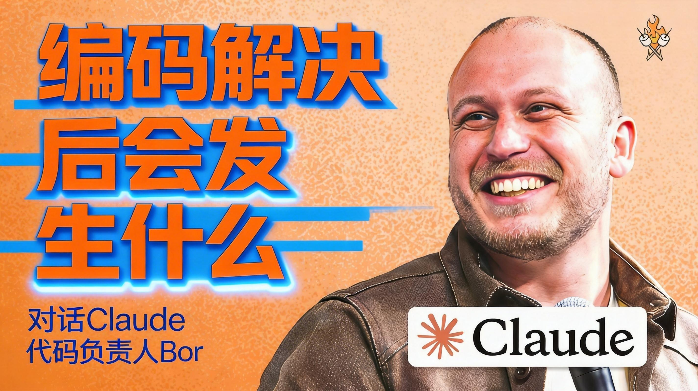

# Web3天空之城 - Bilibili 动态摘要

> 来源：https://www.bilibili.com/opus/1171504724323598370  
> 发布时间：2026年02月20日 23:16  
> 生成时间：2026-02-23 09:06:43

---

## 摘要

Bilibili用户「Web3天空之城」分享其使用Anthropic的Claude Code所带来的编程范式巨变。他自述去年11月以来，100%的代码都由Claude Code编写，不再手动修改，每日提交10-40个拉取请求（PR），使工程师的生产力提高了200%。

文章核心观点在于，AI已在很大程度上解决了编程问题，一两年后“是否学习编程”将不再是疑问。“软件工程师”的头衔将逐渐消失，取而代之的是“构建者（Builder）”，未来每个人都将同时具备产品经理和编程者的能力，工程、设计和产品管理的角色界限日益模糊。

Claude Code的影响力巨大，目前贡献了GitHub上约4%的代码提交，预计到今年底将达到五分之一，且增长速度持续加速。Anthropic在开发中遵循“模型首先擅长编码，然后是工具使用，最后是计算机使用”的心智模型，并强调“苦涩的教训”（The Bitter Lesson）原则，即通用模型最终会超越特定领域模型，因此应押注于通用模型并为“六个月后的模型”构建产品。

未来的AI智能体（Agents）将不仅仅是对话机器人，它们能使用工具并采取行动，支持长时间的无人值守运行（如Opus 4.6可连续工作数天或数周）。“编码”的定义已从编写实际代码演变为“描述你想要什么”。人类的价值将更多体现在决定“构建什么”及“优先级是什么”。

作者建议开发者使用能力最强的模型（如Opus 4.6），善用“规划模式”（Planning Mode），并尝试多样化的交互形态。产品开发应建立快速反馈循环，并响应“潜在需求”（Latent Demand），将AI功能整合到用户现有工作流程中。他将当前的变革类比为15世纪印刷术的发明，将工程师从琐碎编码中解放，专注于系统思考和产品愿景。

虽然工程师和产品经理对AI工具的接受度很高（约70%表示更热爱工作），设计师群体态度则较为复杂。Anthropic内部鼓励“让Claude做优于自己动手”，并要求所有职能岗位具备扎实的技术背景。作者的座右铭是“运用常识”，认为这是工作和生活中最重要的指导原则。他强调，软件开发正经历幅度惊人的变化，但目前仍处于早期阶段（仅完成1%），最出色的工程师将是跨学科的“人工智能原生态者”。

---

## 原始内容

**图片提取文字**：

#### 图片 2

自去年11月以来，我的编程方式发生
了根本性的转变。目前，我100%的代码都由
Claude Code
编写，我不再手动修改任何一行代码
。在日常工作中，我每天会提交10到4
0个拉取请求 (PR)，同时运行着大约
五个代理程序。

我比以往任何时候都更享受编程，因
为我不再需要处理琐碎的细节，每位
工程师的生产力因此提高了200%。
对于“是否应该学习编程”的疑问，
我认为在一两年后这就G再是一个问
题，因为编程在很大程度上已经被AI
解决了。未来将是一个每个人都能随
时构建软件的世界，软件工程师这一
头衔将逐渐消失，取而代之的是“构
建者 (Builder)”。虽然这种转型对
很多人来说是痛苦的，但到今年年底
，每个人都将同时具备产品经理和编
程者的能力。

回顾在 Anthropic 的工作，Claude
Code
对世界产生的影响令人震撼。报告显
示，GitHub
上约有4%的代码提交是由 Claude
Code
贡献的，预测到今年年底这一比例将
达到五分之一。在私有仓库中，这一
数字可能更高。更重要的是其增长速
度正在持续加速。

Claude Code 最初只是 Anthropic
Labs
团队的一个实验性项目。在开发过程
中，我们遵循一个心智模型：模型首
先要擅长编码，然后是工具使用，最
后是计算机使用。当初我加入团队时
，花了一个月进行各种原型试验，并
深入了解模型后训练的研究。作为工
程师，如果你从事人工智能工作，必
须在一定程度上理解模型本身，才能
做好上层应用。

Claude Code
的第一个版本是基于终端的命令行界
面 (CLI)。最初这只是为了开发方便
，但赋予模型
Bash
工具后，它展现出惊人的自主性。
例如，它能自主找到工具来回答我正
在听什么音乐，而我并未对此下达明
确指令。尽管最初内部对这种“终端
形式”的设计持保留意见，但事实证
明，终端是唯一能跟上模型快速进化
节奏的形态。发布后，其内部日活跃
用户数垂直式增长，并随后向外部
发布。

我们对未来的预测是指数级的。在202
4年5月的开发者大会上，我曾预言到
年底工程师可能就不再需要传统的集
成开发环境 (IDE) 来编程。虽然这在
当时听起来很疯狂，但从目前代码生
成的指数增长曲线来看，这正在成为
现实。创新没有固定的路线图，我们
需要给研发人员失败的空间和心理安
全感，让他们在不断的试验中发现突
破口。

目前，编程领域的未来已经清晰。Cla
ude
不仅仅是编写代码，它开始像同事一
样工作：审阅反馈、查看错误报告、
分析遥测数据以进行错误修复，并主
动交付成果。下一步的转变将超越编
码本身。我每天都在使用协同工作 (C
o-work) 功能处理与编程无关的通用
任务，例如处理停车罚单、同步电子
表格数据、管理团队项目以及处理
Slack 和电子邮件沟通。

对于产品经理而言，利用 AI
进行创新的最简单方法就是建立快速
的反馈循环。通过将
Claude Code
或协同工具接入用户反馈频道，模型
可以迅速识别问题并提出修复建议。
这种极速的反馈循环能极大鼓励用户
提供更多建议，从而推动产品的快速
迭代。

让用户感到自己的意见被倾听至关重
要。通常，用户在使用产品并提出反
馈后，往往得不到任何回应，反馈就
像进入了一个黑洞。如果能让人们感
到被重视，他们就会更愿意贡献力量
，主动帮助改进产品。

目前，软件开发领域正经历巨大的变
革。随着自动化工具的普及，构建代
码已不再是核心难题，代码审查 (Co
de
Review) 正在成为下一个瓶颈。在这种
背景下，人类的价值在于决定“构建
什么”以及“优先级是什么”。

在 Anthropic 内部，Claude Code
对生产力的提升是惊人的。过去一年
，虽然工程师团队规模增长了约四倍，
但每位工程师的生产力 (以完整请求
Full Requests 计) 提高了
200%。对于任何致力于提高开发效率
的人来说，这个数字是前所未有的。

在过去，提升代码质量和生产力是一
个缓慢的过程。在
Meta
负责代码质量时，即便数百名工程师
共同努力一年，生产力也可能只提升
几百分点。而现在，这种数倍的增
长已经变得常态化。软件开发和产品
构建的模式正在发生幅度惊人的变化
，尽管身处其中的人很容易习以为常
，但我们必须认识到这其中的疯狂。

随着模型能力的快速更迭，工程师需
要不断更新思维方式。很多新入职的
应届毕业生在处理问题时，比资深工
程师更具
AGI
前瞻性。例如，在处理内存泄漏这一
传统的工程问题时，老牌工程师习惯
于手动抓取堆快照并使用调试器分析
，而新一代工程师则会让
Claude Code
去完成。它不仅能抓取快照，还能为
自己编写分析工具，并以比人类更快
的速度找到漏洞并提交
PR。我们必须时刻提醒自己，不要停
留在旧的模式中，因为模型的能力已
经发生了质的飞跃。

在团队管理上，我们提倡“让 Claude
做某事优于自己动手”的准则。有时
，“资源不足”反而能激发团
队的积极性。当人手有限时，工程师
为了快速交付成果，会更有动力利用
AI
自动化完成大量工作。这种源于内心
的内在驱动力，结合
AI
的能力，能让项目在竞争激烈的市场
中保持速度优势。

关于 AI
是否会取代工程师，我认为关键在于
如何赋权给优秀的工程师。我建议公
司在初期不要过度优化成本，而是给
工程师提供充足的
Token
配额。让他们拥有尝试疯狂想法的自
由，待想法验证可行后，再考虑通过
模型精简 (如从
Opus 切换到
Haiku) 来削减成本。在实验阶段，T
oken
的成本相对于人力成本和业务价值而
言，其实是非常低廉的。

回顾我的职业生涯，编程对我而言一
直是一种实用的构建工具，而非目的
。我自学编程是为了解决实际问题，
比如说为了自动化解出数学题。虽然我
曾一度沉迷于
TypeScript
的类型系统或函数式编程的美感，但
最终我仍认为编码是实现目标的手段
。当然，每个人不同，有些工程师仍
然享受亲手编写
C++ 的过程，这种艺术性在 AI
时代依然有其空间。

我不担心作为工程师的技能会退化，
因为编程模式始终在进化。从早期的
硬开关、穿孔卡片，到后来的虚拟机
和高级语言，我们一直在不断抽象
。未来，底层的编码细节可能会变得
像汇编语言一样，不再需要大多数人
去掌握。

这种转变最恰当的历史类比是印刷术
的发明。在
15
世纪的欧洲，识字率极低，阅读和书
写被少数抄写员垄断。印刷机的出现
让印刷材料的数量急剧增加，成本大
幅下降，最终在几个世纪内实现了识
字的民主化。就像当年的抄写员很高
兴从枯燥的抄录工作中解放出来去
从事书籍装订和插画一样，今天的工
程师也可以从繁琐的编码细节中解脱
，将精力投入到系统思考、用户交流
和产品愿景上。

AI
的这种能力将扩展到产品经理、设计
师和数据科学家等等所有与工程相邻
的职位。未来，AI
将不仅仅是对话机器人，而是能够使
用工具并采取行动的“智能体”(Ag
ents)。它能访问文档、发送邮件、
运行命令并与系统交互，这需要社会
和行业共同探讨其带来的就业影响。

对于想要在动荡中取得成功的个人，
我的建议是：积极实验这些工具，深
入了解并超越它们的边界，不要害怕
它们。同时，要努力成为一个跨学科
的通才 (Quad
Code) 时代，最出色的工程师往往是
那些理解系统架构且具备跨领域视野
的人。

在目前的团队中，每个人都在编写代
码，无论是产品经理、工程经理、设
计师、财务人员还是数据科学家。最
出色的工程师往往是跨学科的通才：
他们可能是产品与基础设施的混合体
，或者是具有出色设计感的开发人员
，亦或是对业务有深刻理解并能以此
决定产品方向的工程师。在未来几年
，获得最大回报的人将是那些不仅擅
长使用AI工具，而且充满好奇心、能
够跨学科思考宏大问题的“人工智能
原生态者”。

虽然工程、设计和产品管理这三个学
科在短期内仍将持续存在，但角色之
间的界限变得日益模糊，重叠已
高达50%。很多人实际S在做着同样
的事情。到今年年底，这种趋势会更
加明显。在某些组织中，“软件工程
师”这一头衔可能会逐渐消失，取而
代之的是“构建者” (Builder)；或
者演变为每个人都是产品经理，同时
每个人也都在编写代码。

根据一项针对AI工具采用后的非正式
调查显示，约70%的工程师和产品经
理表示他们比以前更热爱自己的工作
。有趣的是，设计师群体中只有55%
的人持正面态度，而有20%的人表示
更不喜欢目前的工作。在Anthropic，
我们对所有职能岗位都有扎实的技术
背景要求。即便是非技术职能的员工
，也需要经历技术面试。我们的设计
师大多会编程，他们很享受这种能力
，因为这让他们不必依赖工程师就能
自行解决障碍，直接编写代码实现想
法。

为了让非工程师更自然地使用模式
工具，我们将功能直接整合进桌面应
用程序中。通过内置的协同工作模式
，用户无需打开复杂的终端即可获得
强大的代码处理能力。我们的原则是
将产品带到用户所在的地方，而不是
强迫用户改变工作流程去学习新事物
。只要能让用户正在做的事情变得更
容易，产品就会更受欢迎。

这种产品思路源于“潜在需求”(Lat
ent
Demand) 原则。当用户以非设计本
意的方式“滥用”产品来达成目的时
，这就为产品构建者指明了方向。例
如，Facebook发现大量用户在群组中
买卖物品，由此诞生了Marketplace
；我们发现用户使用代码工具来分析
基因组、恢复损坏硬盘中的照片甚至
分析核磁共振图像，这些非技术用例
表明我们需要为他们构建更易用的产
品。

#### 图片 3

在AI时代，这种潜在需求也适用于模
型本身。传统的做法是将模型“装进
盒子”，作为应用的一个组件；而我
们的方式是让模型成为产品核心，为
其提供最少的脚手架和工具集，让模
型自主决定运行哪些工具以及运行顺
序。

我们的协作功能在短短10天内就完成
了构建，这完全是基于巨大的需求压
力。我们选择提早发布那些尚显粗糙
的研究预览版，以便在现实环境中获
取反馈。对于像Anthropic这样的安全
实验室，提早发布也是为了安全性研
究。模型安全包含三个层面：一是机
制可解释性，即在神经元层面理解模
型如何规划和编码概念；二是在实验
室受控环境下研究模型的行为；三是
观察模型在实际环境中的表现。随着
模型日益复杂，第三层观察变得至关
重要。

我们坚持将大量安全性工作和工具（
如开源沙盒）公之于众，旨在激励整
个行业以安全的方式进行竞争，这被
我们称为“登顶峰冲刺”。

目前，工程师和产品经理的工作方式
正在发生巨变。如今的“编码”更多
是指描述你想要什么，而不是编写实
际的代码行。这种工作模式让一个人
可以同时运行多个智能体代理。未来
，你可能在移动端查看智能体的进度
，在桌面端进行协作，在终端处理核
心逻辑。正如历史上“编程”概念的
演变一样，现在的“编码”正演变为
一种更高层次的构建与表达。

### 从打孔卡到通用模型：访谈实录

**家族记忆与编程的演变**

我出生在乌克兰的敖德萨。我的祖父
是苏联最早的一批程序员之一，那时
他们还使用打孔卡进行编程。他曾回
忆起那些堆积如山的打孔卡。在他母
亲（我的曾祖母）眼中，那些卡片只
是给小孩子用蜡笔涂鸦的纸片。那一
代程序员经历了从硬件打孔到软件转
型的剧变。当时很多老一辈程序员并
不看重软件，认为那算不上真正的编
程。但这正是技术领域的本质：它始
终在不断变化。

我的家人于1995年离开乌克兰来到美
国，这比主持人一家在1988年离开稍
晚一些。每当想到如果当初没有离开
，生活会有多么不同，我都会感到无
比幸运。在我们的家庭聚会中，长辈
们经常通过祝酒表达对现状的感激。
虽然我们身处美国，但这种祝酒的习
惯，以及杯中的伏特加，依然保留着
家乡的味道。

**构建AI产品的核心建议**

在开发AI产品时，开发者往往有一种
本能，试图限制模型的行为，将其塞
进一个极其特定的工作流中。例如，
强制模型必须先执行步骤一，再执行
步骤二。实际上，更好的做法是为模
型提供工具和目标，让它自己寻找解
决方案。一年前，我们可能还需要大
量的“脚手架”来辅助模型，但现在
的模型已经不再需要这种过度策展。
给它工具，让它自行获取所需的上下
文，通常会得到更好的结果。

这里涉及到－个被称为“苦涩的教训
”（The
Bitter
Lesson)的原则，由查德·萨顿（Ri
chard
Sutton)提出。其核心观点是：通用
模型最终会超越特定领域的模型。
在构建产品时，不要过度依赖微调或
微小模型，而应始终押注于通用模型
。尽管外围的脚手架代码可能在短期
内提升10%到20%的性能，但当下一
个更强大的模型发布时，这些优势往
往会被抹去。

**为未来的模型而设计**

我们开发Claude Code（或称Quad
Code)时遵循的一个最终原则是：为
六个月后的模型构建产品，而不是为
当下的模型构建。在项目早期，我写
的代码很少，因为当时的3.5系列模型
在编程方面还不够成熟。我们的赌注
是，模型终究会进化到能够自主编写
大量代码的程度。随着Opus
4和Sonnet
4的发布，我们迎来了转折点，产品也
随之呈指数级增长。

对于初创公司来说，这种策略起初可
能会让人感到不安，因为你的产品在
头几个月可能无法达到完美的市场契
合度。但一旦新一代模型发布，你的
产品将立即起飞。

**AI智能体的未来趋势**

未来的模型将在两个方向上显著进化
：一是更擅长使用工具和操作计算机
；二是能够支持长时间的无人值守运
行。一年前，模型运行30秒可能就会
失控，需要人工引导。但现在，像Op
us
4.6这样的模型可以在无人看管的情况
下运行20到30分钟，甚至有案例显示
它们可以连续工作数天或数周。

**专业开发者的使用技巧**

对于希望精进AI工具使用技能的人，
我有三点建议。首先，始终使用能力
最强的模型（如Opus
4.6）。虽然高性能模型的单价看似更
高，但由于其智能程度更高，完成相
同任务所需的Token更少，且不需要
频繁的人工修正，实际成本反而更低
。

其次，善用“规划模式”（Planning
Mode）。在要求模型编写代码前，先
通过提示词要求它“不要立即写代码
，先制定计划”。这种简单的交互能
显著提升任务的成功率。最后，尝试
多种交互形态。无论是终端、桌面应
用、移动端还是Slack集成，每个工程
师的偏好不同，找到最适合自己工作
流的界面非常重要。

**关于竞争与Anthropic的理念**

面对日益激烈的代码智能体竞争，我
们并不花太多时间盯着竞争对手。我
们更倾向于直接与用户沟通，根据反
馈快速迭代产品。Anthropic的理念一
直是通过研究和安全实验来推动模型
进化。

Claude
Code之所以能成为一项巨大的业务，
是因为我们长期坚持这种信念。尽管
目前收入规模已达到惊人的水平，但
我们仍感觉处于早期阶段。世界上大
部分人还没有开始使用AI，我们才刚
刚完成了1%的进度。

**AGI之后的个人愿景：味噌与长期思
维**

在加入Anthropic之前，我曾住在日本
的农村。那里的生活节奏与旧金山截
然相反，社交活动围绕着季节和食物
展开。我学会了制作味噌，这是一种
需要极度耐心的手艺：白味噌需要三
个月，而红味噌则需要三到四年。

这种长期技能的思维方式对我影响深
远。工程师学徒往往追求速度，但制作味
噌教会我与时间共处。我曾开玩笑说
，如果达到通用人工智能（AGI）之后
我不再从事技术工作，我可能会去专
心制作味噌。这种对长周期时间尺度
的思考，也是我最终加入Anthropic的
原因之一——我希望为技术向好的方
向发展做出贡献。

**书籍与产品推荐**

在技术书籍方面，我最推荐《函数式
编程（Scala版）》，它展现了类型思
维的优雅，深刻影响了我的编码习惯
。科幻小说方面，查尔斯·施特劳斯的
《加速》（Accelerando)精准捕捉
了我们所处时代的加速速度感；刘慈
欣的《流浪地球》短篇集则提供了不
同于西方科幻的独特视角。

此外，我非常推崇“Co-Work”这类
智能体产品。它能自动完成繁琐的浏
览器任务，如填写复杂的医疗表格或
处理交通罚款单。这种从“对话框”
到“实际执行”的转变，预示着AI工
具的新篇章。

### AI工具的多样化应用与自动化

目前的AI
工具已经能胜任许多具体任务，例如
整理桌面、总结电子邮件或直接代为
回复。它最核心的能力之一是连接不
同的工具。通过简单的指令，AI
可以读取邮件、发送Slack
消息，或者将数据整理到电子表格中
。

我目前通过它来管理所有项目。我们
团队有一份共享的电子表格，每位工
程师每周都会填写工作状态。协作机
器人会在每周一自动检查进度，并向
尚未填写状态的成员发送
Slack
提醒。这只需要一个提示词就能完成
所有工作，无需我亲力亲为。

此外，AI
还能并行处理多项任务。我可以启动
一个项目管理程序或其他任务，它在
运行期间去喝杯咖啡，利用这段时间
处理其他事务。这种协作方式极大地
拓展了工作边界。很多人之所以没有
尝试，往往是因为还没意识到
AI

能做到这些。伦尼（Lenny)曾发过一
篇关于非技术用例的帖子，我们的产
品经理在发布
Cowork
之前，就以此作为评估标准。当我们
发现产品能完成其中绝大多数用例时
，就意识到它已经足够成熟。

### 核心价值观：运用常识

如果在工作和生活中有一个长期遵循
的座右铭，那就是“运用常识”。

我观察到许多职场中的失败，本质上
都是因为人们停止了思考，只是不假
思索地遵循流程，或是在惯性驱动下
开发平庸甚至错误的产品。我始终认
为最好的结果源于从“第一性原理”
出发，并建立起个人的常识判断。如
果某件事在直觉上让人感到异样，那
么它大概率不是一个好主意。相比其
他建议，我最常对同事说的就是这一点
。

### 从 Threads 到 Twitter
的互动体验

关于最近在
Twitter (X) 上变得活跃，这其实源
于一个偶然的契机。

很长一段时间里我只使用
Threads，因为我曾参与过该产品的早
期构建，非常喜欢它简洁的设计。去
年十二月，我和妻子在欧洲旅行期间
，我把那段时间当作一个“编码假期
”。我每天都在写代码，这是我最喜
欢的度假方式。在某个时刻，当我暂
时没有新的灵感时，我打开了
Twitter，看到有人在讨论我们的产品
，于是便开始回复。

我发起了一个自我介绍，邀请大家反
馈错误（Bug）和意见。很多人对我们

#### 图片 4

修复问题的速度感到惊讶，但对我来说
这很自然。只要用户描述清晰，我
可以在几分钟内修复错误并继续处理
下一件事。在
Twitter
上与用户直接互动、听取功能建议并
实时改进产品，这种体验非常出色。

### 反馈与联系方式

如果你有任何建议、功能请求或发现
了产品错误，可以通过
Threads 或 Twitter
与我联系。我很乐意被标记在相关讨
论中，听取关于如何改进产品的反馈
，了解用户真正的需求。
