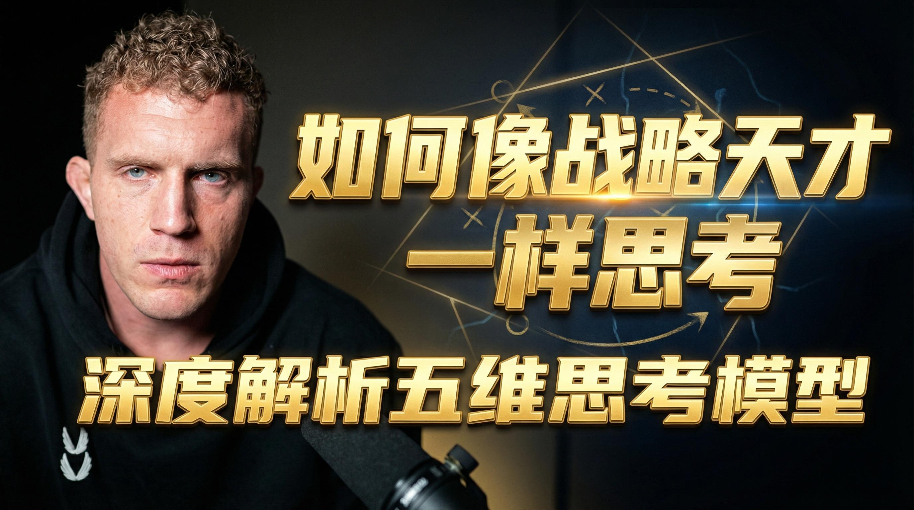

# Web3天空之城 - Bilibili 动态摘要

> 来源：https://www.bilibili.com/opus/1172392107526062080  
> 发布时间：2026年02月23日 08:40  
> 生成时间：2026-02-23 09:39:59

---

## 摘要

Bilibili用户“Web3天空之城”的动态揭示，人生成功并非仅靠智力，而是由“思考”这一底层驱动力决定。文章指出，聪明人未能过上理想生活的核心在于思维局限。

文章区分了两种思维模式：“愚蠢的思维”和“天才思维”。愚蠢的思维并非指智力低下，而是普遍存在的认知模式，具备四个特征：单一维度、还原论、部落式、从不质疑，其本质是在思考触及边界时过早关闭心智。相对地，“天才思维”定义为抱有“理解”而非“知道”的意图，能将威胁性想法置于可能范畴，其标志是思维的广度、深度与维度，能整合思想与现实网络，避免陷入“领域孤岛”。

为提升思考力，文章引入“线、层级与高度”的系统化框架。
1.  **线**：特定领域的知识深度。
2.  **层级**：认知演进的五个阶段（第一零层级：本能反应；第一层级：服从式思维；第二层级：个人主义；第三层级：综合思维；第四层级：生成性思维）。高层级的“第二梯队思维”拒绝教条，寻求真理与权衡，强调多维度同步发展。
3.  **视角**（现实的四个象限）：个体内在、集体内在、个体外在、集体外在。天才思维能同时从这四维度观察问题。
此外，思考的第五个维度是“历史的力量”，强调理解事物演进的总体模式，而非死记事实，正如克里希那穆提所言，需超越当下的社会局限。

文章强调“知道”是横向知识积累，“理解”是纵向认知操作系统复杂度的提升。人生循环（获取信息—思考—做出选择—接收反馈）的质量由思维方式决定。世界由“整体”与“部分”构成，万物遵循“超越并包含”的演化逻辑，新的事物超越并吸纳了旧的基础。个体关怀圈的扩展（自我到宇宙）及社会形态（前现代至智能时代）的演进，均需遵循此原则。

面对智能时代，固守工业时代思维如同运行过时软件，需“超越并吸纳”新事物。日常互动中，许多人受限于“身份认同”和“文化气泡”，重复教条而非真正思考。为突破平庸，需采纳“包罗万象的世界模型”，不让身份认同限制思维。实践方法是增加“心智空间”，在质疑与冲突中停顿观察，打破机械化循环，扩展多元观点，从而解决复杂问题。

---

## 原始内容

**图片提取文字**：

#### 图片 2

在当今社会，我们常发现一个悖论：一些极度聪明、善于深度分析的人并未过上理想的生活；而另一些在传统标准下看似并不出众的人，却能收获幸福、健康与财富。这种现象背后的核心差异在于“思考”这一决定性因素。思考并非仅仅是逻辑推演，它是人生成功的底层驱动力。如果你能掌握思考的艺术，就能打破现有的认知局限。

要理解天才般的思维，首先需要识别其对立面——“愚蠢的思维”。这里的“愚蠢”并非指智力水平，而是一种普遍存在的思维模式。愚蠢的思维通常具有四个特征：第一，它是单一维度的，难以看到自身视角之外的局限；第二，它是还原论的，倾向于将复杂问题简单化（例如将一切商业挑战归结为战略问题）；第三，它是部落落式的，盲目信任所属群体的观点，
排斥异见；第四，它从不质疑，习惯于以“事情本就如此”为由停止探索。本质上，愚蠢的思维是在思考触及边界时过早地关闭了心智。

相比之下，天才思维的定义是：在保持将具有威胁性的想法置于可能范畴内的同时，抱有去“理解”而非仅仅是“知道”的意图。天才思维的标志在于思考的广度、深度与维度。它不将某种想法视为绝对真理，而是能够遍历思想与现实的完整网络，将其整合为连贯且有用的东西。

在现实生活中，许多聪明人会陷入“领域孤岛”。例如，一个务实的商人可能将他人的抑郁仅仅视为生产力问题，而一个抽象的灵性人士可能将商业失败完全归因于能量频率。事实上，双方都有正确的一面，关键在于如何根据不同情境应用不同的思维方式。

如果你能察觉到自己思维的停滞点并主动解锁新的视角，你就拥有了解决复杂问题的能力。

我们需要区分“知道”与“理解”。“知道”是横向的，代表领域专业知识的积累，如记忆事实和学习教科书；而“理解”是纵向的，关乎认知操作系统的复杂程度。如果一个人只积累知识而不升级“操作系统”，就像在旧款手机上运行复杂的现代程序，效率会极其低下。这就是为什么有些人在某个领域极其成功，但在人际关系或心理健康方面却一团糟，因为他们缺乏跨领域的理解力。

人生的循环是由“获取信息—思考—做出选择—接收反馈”构成的。思维方式决定了每一环的质量。愚蠢的思维会产生负向复合效应，让你陷入无
法脱困的深坑。真正的学习并非死记硬背，而是通过实践、失败和迭代来扩展思维。

为了系统化提升思考力，我们可以参考“线、层级与高度”的框架。

第一维度是“线”，代表特定领域的知识深度（如市场营销或物理学）。

第二维度是“层级”，代表认知的演进：

第一零层级：本能反应，完全出于生存需要。

第一层级：服从式思维，非黑即白，盲从权威与规则。

第二层级：个人主义，开始产生批判性思维并构建个人模型。

第三层级：综合思维，将不同模型视为工具，理解矛盾中的真理。

第四层级：生成性思维，能够产生原创性的观点。

高层级的思维（第二梯队思维）倾向于拒绝教条，寻求真理，明白绝对的真理往往不存在，存在的只有权衡。当你在某个领域遇到瓶颈时，往往是因为你在其他相关领域（如情商或社会动力学）的能力不足。要成为真正的领导者或卓越的创造者，必须在多个维度上同步发展。

第三维度是“视角”，即现实的四个象限：

1.
个体内在（心理）：思想、情感、信念。

2.
集体内在（文化）：群体价值观、意识形态。

3.
个体外在（行为/生理）：可见的行为、大脑状态、身体指标。

4.
集体外在（系统）：社会制度、结构、技术工具。

大多数专家只关注其中一个象限。天才思维则要求你能够调整镜头，从这四个维度同时观察一个问题。例如，
学习市场营销不仅仅停留在复制他人的技巧，而是通过研究心理学、文化趋势和技术系统，形成深层模式识别，从而获得真正更准确的竞争优势。

思考的终极目标是解决问题。当一个人停止思考，问题就会成倍增加。通过四个维度的追问——社会如何影响文化、个人行为如何产生影响、系统现状如何、内在感受如何——我们可以建立起完整的思考路径。

最后，思考还存在第五个维度：历史的力量。了解事物随时间演变的规律，能让我们更准确地预见未来。我们追求的不是死记硬背历史事实，而是理解其演进的总体模式。正如克里希那穆提所言：“适应一个病态的社会，并不能说明你自身的健康。”真正的思考者应当超越当下的社会局限，
利用历史的深度与多维的视角，构建属于自己的智慧体系。

从宏观视角审视现实，我们会发现世界是由“整体”与“部分”共同构成的。每一个整体同时也是更高层级整体的一部分。例如，物质演化为生命，生命演化为心智；在语言中，词语构成句子，句子组成段落，进而形成章节、书籍乃至图书馆。这种结构同样存在于社会与宇宙中，从个体到家庭，再到城市、国家、行星、星系。万物以这种方式相互关联，构成了现实的图景。

事物的每一次演化都遵循“超越并包含”的逻辑。当新的事物出现时，它不仅超越了先前的状态，也将其作为基础包含在内。如果只追求超越而不进行包含，系统就会出现问题。整体
依赖于其组成部分的完整性，若移除其中之一，整体便会走向自我毁灭。例如，环保主义者关注气候变化，是因为如果生物圈崩溃，人类也将随之毁灭。

与此相对，技术人员倾向于通过加速和进步来解决问题。他们认为，通过创造更先进的技术可以改善并维持生物圈。环保主义者则主张通过改变现状和减缓资源消耗来保护环境。这两种观点虽然视角不同，但在进化的逻辑下都有其合理性。

个体在生理和心智上的演化，表现为关怀圈的不断扩大。人类的发展通常从以自我为中心开始，逐渐扩展到以族群（或民族）为中心、以世界为中心，最终达到以宇宙或实在本身为中心。在这个过程中，必须遵循“超越并包含”的原则。许多人试图跳过中
间层次，直接宣称自己是关心全人类的世界主义者，却忽略了对自身和所属群体的基本关怀。然而，如果无法照料好自己，就无法真正为世界付出。

社会的演化同样交织着物质工具与精神价值。从原始部落、村庄到帝国和民族国家，技术的进步——从狩猎工具、灌溉系统到工业机器和计算机——不仅带来了物质盈余，也推动了世界观的变革。社会形态从前现代、现代演进至后现代，思维方式也随之从前理性、理性转向后理性乃至超理性。

在当前的智能时代，如果仍沿用工业时代的思维模式，如“上学、找工作、退休”的固定路径，就如同运行一套过时的软件。面对人工智能的兴起，我们需要思考如何将其整合到现有
的体系中，做到“超越并吸纳”。若无法创造性地思考未来，个体将在自动化的浪潮中面临被淘汰的风险。

在日常互动和社交媒体辩论中，识别思维模式至关重要。许多人只是在重复被灌输的、教条化的观点，而非进行真正的思考。他们往往受限于自身的身份认同，将特定的信念视为自我的一部分。当这些信念受到挑战时，他们会感到威胁并产生防御心理。这种对特定立场或意识形态的执着，限制了思维的广度和深度。

采纳一个包罗万象的世界模型，而非受限于单一维度的意识形态，才能看清事物的真相。这并不意味着必须反对某种价值观，而是要意识到，当他人持有不同意见时，并不代表你的身份受到了威胁。无论是政治、宗教还
是职业领域，过度的身份认同都会导致盲目的争吵，让人原地打转。

我们的大部分信息源于出生时的文化环境。为了生存，我们已在具备独立思考能力之前就接受了这些价值体系。这些潜意识里的“气泡”限制了我们对现实的解读。一个人的心智层次决定了其接收信息、解读现实并做出选择的方式。如果只在他人设定的界限内思考，人生的结果往往是平庸且机械的。

提升思维能力的实践方式在于增加心智空间。当面对质疑或冲突时，尝试停顿下来，观察自己的感受，而不是立即做出反应或陷入自我辩护。通过这种方式，我们可以打破机械化的思维循环，扩展持有多样化观点的能力，从而更好地应对复杂多变的现实。
